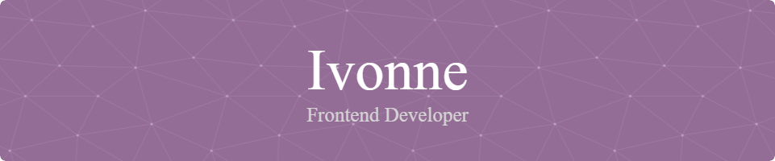

  # 🌸 ¡Hola! , yo soy...

<div align="center">
  


</div>

## 🚀 Sobre mí

```typescript
const developer = {
    name: "Ivonne Mendez Cruz",
    college: "ESCOM, IPN",
    location: "CDMX",
    passions: ["Coding", "Music", "Gaming", "Dance"],
    currentFocus: "Aprendiendo redes neuronales ",
    funFact: "El diseño UX y la IA son mis pasiones 🎵"
};
```


<div align="center">

[](https://www.linkedin.com/in/ivonne-mendez-cruz-645b9222b?utm_source=share&utm_campaign=share_via&utm_content=profile&utm_medium=android_app)
[](https://open.spotify.com/user/22dum4e5oyzjejdn2u3akw7xy?si=2e73f1de296749e9)
[](mailto:ivonne_cruz_22@hotmail.com)

</div>

## ☁️ Conocimientos en...

<div align="center">

### Frontend


### Design


### Backend


### Database


### Machine Learning & AI


### Tools & Platforms


</div>

## 📊 Estadísticas de GitHub

<div align="center">
  


</div>

<div align="center">
  
[](https://git.io/streak-stats)

</div>


## 🎯 En lo que estoy trabajando

- 🔭 **Proyecto actual:** Don-Keys - Una aplicación web para estudiantes que buscan donde rentar
- 🌱 **Aprendiendo:** Redes Neuronales
- 👯 **Colaboración:** Buscando colaborar en proyectos open source
- ⚡ **Dato curioso:** Mi mayor hobbie es el baile

## 🏆 Logros

<div align="center">

[](https://github.com/ryo-ma/github-profile-trophy)

</div>

## 📈 Actividad Reciente

<!--START_SECTION:activity-->
<!--END_SECTION:activity-->

## 🎨 Proyectos Destacados

<div align="center">

[](https://github.com/bolillochaan/nombre-repo-1)
[](https://github.com/bolillochaan/nombre-repo-2)

</div>

## 🌟 Quote del Día

<div align="center">


</div>

## 📝 Blog Posts Recientes

<!-- BLOG-POST-LIST:START -->
<!-- BLOG-POST-LIST:END -->

## 💡 Random Dev Quote

<div align="center">


</div>

---

<div align="center">


**¡Gracias por visitar mi perfil! 🚀**

*"El código es poesía en movimiento"* ✨

</div>

<div align="center">


</div>
